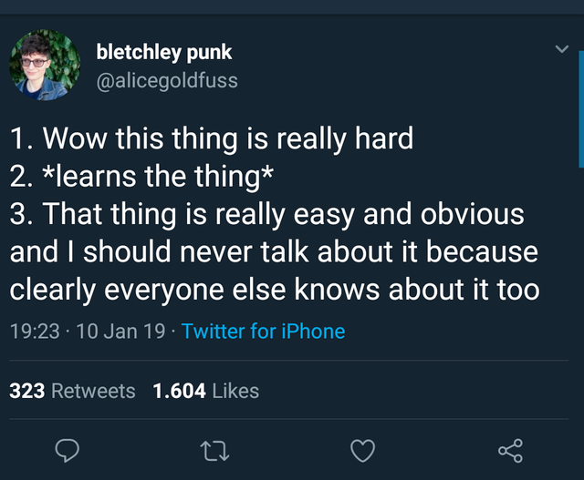

This last week I saw this tweet:

And decided that it was finally time.

I've recently started a repo called [sidnky](https://github.com/rafael-vitor/sidnky) which
stands for **Stuff I Do Not Know Yet** (I'm not good with names). It's a list of things I've
come across and for some reason didn't dedicate the time to properly understand it on a
satisfying level and some tips on how to go about properly learning them. This was inspired
by Dan Abramov's post about
[Things he doesn't know as of 2018](https://overreacted.io/things-i-dont-know-as-of-2018/)
from whom I've also taken the idea of using
[gatsby-starter-blog](https://github.com/gatsbyjs/gatsby-starter-blog)
to quickstart my own.

Sidnky's purpose is to help me take the time to properly study the things I find interesting
and this blog will hopefully get me to share these pieces of knowledge so they can exist
on the internet where anyone, maybe even me from the future after not being in contact with
a specific topic for some time, can absorb it.